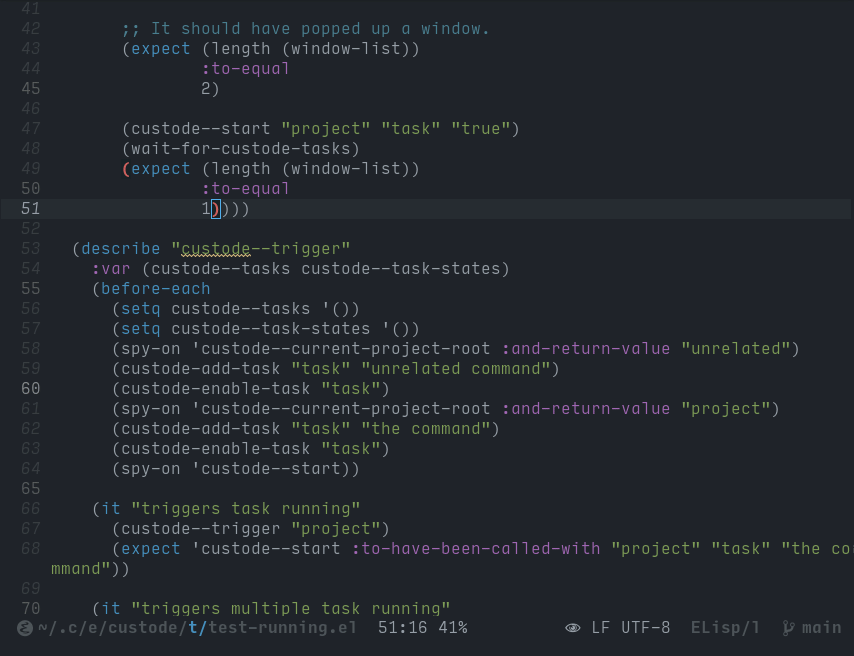

# Custode

Custode is a "file watcher" for Emacs that runs commands in the
background, and only pops up when a command fails.

Automatically running build or tests when saving files has been
popularized in the last decade or so, but most tools requires you to
keep an eye on a shell window (or buffer), in order to make sure you
didn't break something.

Custode does it a bit differently:
* It runs commands on file save in Emacs. 99% of the time, this is
  what one needs, and for the last 1% there's still the excellent
  [entr](https://github.com/eradman/entr).
* It doesn't show any output per default, but only pops up the output
  buffer when the command failed.

While having a build/test window more or less permanently scrolling
does gives a nice "Matrix hacker" feel to developing, it is probably
more mentally healthy to not have this possible distraction.



# Requirements

Emacs 28, because that's what I'm using, and it haven't been tested on
earlier versions (yet).

Custode uses the built in `project` and `compile` Emacs packages for
most of the heavy lifting.

# Setup

Example using [use-package](https://github.com/jwiegley/use-package),
[elpaca](https://github.com/progfolio/elpaca) and
[doom-modeline](https://github.com/seagle0128/doom-modeline):

``` emacs-lisp
(use-package custode
  :elpaca (:type git :host github :repo "xendk/custode.el")
  :init
  ;; Enable Custode.
  (global-custode-mode)
  :config
  ;; Bind the keymap in the project prefix map. This will make it 
  ;; available on C-x p u. You can choose whatever key fits you.
  (with-eval-after-load "project"
    (define-key project-prefix-map "u" custode-prefix-map))
  ;; Add lighter to mode-line (this is how doom-modeline) suggests
  ;; adding a lighter for a single minor-mode.
  (add-to-list 'global-mode-string (list t custode-lighter)))
```

If you're using
[straight](https://github.com/radian-software/straight.el), it
replacing `:elpaca` with `:straight` should suffice. Users of other
package/configuration managers should be able to gleen the important
bits from the above.

# Usage

In a buffer visiting a file that is part of a project recognized by
`project`, you'll have the following commands available on the prefix
you configured:

* `c`: Create a new command for the project. The command should be a
  command that can be run by the shell. New commands always starts out
  disabled, so adding a command wont make anything happen in itself.
* `k`: Remove a command.
* `w`: Watch a command. This makes custode run this task whenever
  saving a file in the project. When run interactively, this will also
  trigger the command (can be suppressed with a prefix argument).
* `W`: Stop watching command. Stops a command from running
  automatically again. Interactively, this will also delete the output
  buffer, unless called with a prefix argument.
* `a`: Set command arguments. When arguments has been set, they're
  added to the shell command when run. A use case is temporarily
  adding arguments to a test command to only run a subset of tests.
  Note that arguments only persist in the current Emacs session,
  they're not saved to the configuration file. Arguments can be unset
  by supplying an empty string.
* `l`: Loads commands from the configuration file (`.custode` per
  default, can be configured with the `custode-save-file` custom
  option) in the root of the project. This should seldom be needed as
  commands are automatically loaded on project discovery.
* `s`: Saves configuration to the configuration file in the project
  root.
* `p`: Select how to position the output buffer when the command has
  run and failed. Depending on the run command, start or end of buffer
  might be most appropriate. This is saved with the configuration.


# Recommended configuration

## Colors

Most tools these days use colors, but Emacs compilation buffers
doesn't support colors per default, but since 28.1 it can be
configured to do so:

``` emacs-lisp
(require 'ansi-color)
(add-hook 'compilation-filter-hook 'ansi-color-compilation-filter)
```

Or with use-package:

``` emacs-lisp
(use-package ansi-color
    :hook (compilation-filter . ansi-color-compilation-filter)) 
```

Alternatively, there's a package that adds color support and a few
other nifty improvements to compilation buffers:
https://codeberg.org/ideasman42/emacs-fancy-compilation

## Doom-modeline

If you're using doom-modeline, you can add the following to your
configuration in order to show the Custode lighter in the mode-line
without showing all minor modes:

``` emacs-lisp
(add-to-list 'global-mode-string custode-lighter)
```
